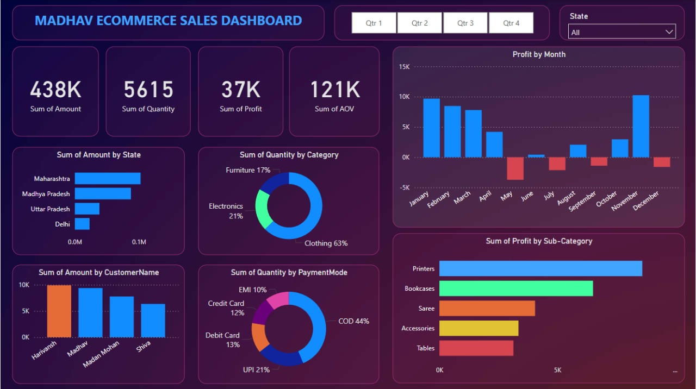

# 🛒 Ecommerce Sales Dashboard (Power BI)

This project presents an interactive Power BI dashboard to track and analyze online sales performance for an eCommerce business.

---

## 🔍 Project Highlights

- Created an interactive dashboard to monitor and analyze online sales data.
- Used complex parameters to enable drill-down functionality with filters and slicers.
- Connected and joined multiple tables; used calculated fields and measures for advanced analytics.
- Implemented user-driven parameters for dynamic visualizations.

---

## 📊 Visualizations Used

- Bar Chart
- Pie Chart
- Donut Chart
- Clustered Bar Chart
- Scatter Chart
- Line Chart
- Area Chart
- Map
- Slicers

---

## 🧠 Skills Demonstrated

- Power BI data modeling and transformation
- Dashboard and report creation
- DAX measures and calculated columns
- Data visualization best practices

---

## 📁 Project File

- [`Ecommerce Sales Dashboard.pbix`](Ecommerce%20Sales%20Dashboard.pbix)

---

## 🖼 Dashboard Preview

